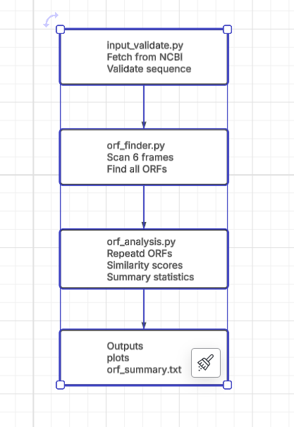

<p align="center">
  
</p>

# ORCA — ORF Recognition and Comparative Annotator

## Objective

ORCA is a Python-based bioinformatics pipeline that automates Open Reading Frame (ORF) detection and analysis across DNA sequences. It accepts an NCBI accession number or a local FASTA file, fetches or loads the DNA sequence, detects all ORFs across all six reading frames, and computes per-ORF statistics including GC content and protein length. When two sequences are provided, ORCA performs side-by-side comparative analysis including pairwise sequence alignment and shared ORF detection.

---

## Features

- Downloads DNA sequences directly from NCBI using an accession number, or loads them from a local FASTA file
- Validates and cleans input sequences (handles IUPAC ambiguity codes, whitespace, and invalid characters)
- Scans all six reading frames (+1, +2, +3, −1, −2, −3) using NumPy vectorization
- Detects canonical (ATG) and non-canonical (GTG, TTG) start codons
- Computes per-ORF statistics: GC content, protein length (number of complete codons), and strand/frame information
- **Comparative mode** (`--accession2` / `--fasta2`): side-by-side ORF statistics, global (Needleman-Wunsch) and local (Smith-Waterman) pairwise alignment, and shared ORF sequence detection
- Generates an ORF map visualisation across all six reading frames (PNG)
- Writes all results to the `output/` folder as CSV files and plain-text reports

---

## Project Structure

```
ORCA/
├── README.md
├── LICENSE
├── environment.yml
└── src/
    ├── __init__.py
    ├── main.py                        # Everyone
    ├── graphics.py                    # Nicole Decocker
    ├── input_validate.py              # Tahmid Anwar
    │
    ├── analysis_lib/                  # Amanda Yaworsky
    │   ├── __init__.py
    │   ├── orf_analysis.py
    │   └── statistics_summary.py
    │
    └── orf_finder_lib/                # Nicole Decocker
        ├── __init__.py
        ├── frame_scanner.py
        └── orf_finder.py
```

<p align="center">
  
</p>

---

## Installation

### Dependencies

- Python 3.10
- numpy
- matplotlib
- Biopython

### Setup

1. Clone the repository:
```bash
git clone https://github.com/TahmidA139/ORCA.git
cd ORCA
```

2. Create and activate the conda environment:
```bash
conda env create -f environment.yml
conda activate ORCA
```

---

## Usage

Run all commands from the project root directory with the `ORCA` environment activated.

### Input source rules

- Sequence 1: provide **either** `--accession` **or** `--fasta`, not both.
- Sequence 2: provide **either** `--accession2` **or** `--fasta2`, not both.
- Local FASTA files must contain **exactly one** sequence.

### Command-Line Arguments

| Flag | Required | Default | Description |
|------|----------|---------|-------------|
| `--accession` | See note | — | NCBI accession number for sequence 1. Cannot be used with `--fasta`. |
| `--fasta` | See note | — | Path to a local FASTA file for sequence 1. Cannot be used with `--accession`. |
| `--accession2` | No | — | NCBI accession number for sequence 2. Enables comparative mode. |
| `--fasta2` | No | — | Path to a local FASTA file for sequence 2. Enables comparative mode. Cannot be used with `--accession2`. |
| `--email` | Yes | — | Email address required by NCBI Entrez. |
| `--start-codons` | No | `ATG` | One or more start codons: `ATG`, `GTG`, `TTG`. |
| `--min-length` | No | `30` | Minimum ORF length in nucleotides. |
| `--outdir` | No | `output/` | Directory for all output files. |

**Note:** exactly one of `--accession` or `--fasta` must be provided for sequence 1.

### Usage Examples

Single sequence from NCBI — all defaults (ATG only, minimum 30 nt):
```bash
python -m src.main --accession NM_001301717 --email you@example.com
```

Single sequence from a local FASTA file:
```bash
python -m src.main --fasta example_input_files/sequence.fasta --email you@example.com
```

Single sequence — all three start codons, minimum 150 nt:
```bash
python -m src.main --accession NM_001301717 --email you@example.com \
    --start-codons ATG GTG TTG --min-length 150
```

Comparative mode — two NCBI accessions:
```bash
python -m src.main --accession NM_001838.4 --accession2 NM_012367.1 \
    --email you@example.com
```

Comparative mode — two local FASTA files:
```bash
python -m src.main \
    --fasta  example_input_files/sequence1.fasta \
    --fasta2 example_input_files/sequence2.fasta \
    --email  you@example.com
```

---

## Module Descriptions

### `main.py`
Entry point for the pipeline. The `ORCAPipeline` class orchestrates all modules in order: input validation → ORF detection → statistics → CSV/text output → visualisation.

### `input_validate.py`
Handles all input: fetches sequences from NCBI Entrez or loads them from local FASTA files, validates the email address format, cleans the raw sequence (removes whitespace and digits, strips non-IUPAC characters, replaces ambiguity codes with `N` to preserve reading frame), and writes the cleaned FASTA to disk.

### `orf_finder_lib/frame_scanner.py`
Low-level frame scanner. Converts DNA strings into NumPy codon arrays and locates all ORFs within a single reading frame that pass the minimum-length filter. For each stop codon position, the longest ORF (earliest start codon) is kept. Handles reverse-complement strand scanning and coordinate conversion back to the forward-strand reference.

### `orf_finder_lib/orf_finder.py`
High-level ORF orchestrator. Calls `frame_scanner` across all six reading frames and assembles results into a nested dictionary (grouped by start-codon type: canonical vs. non-canonical) and a flat list suitable for CSV output.

### `analysis_lib/orf_analysis.py`
Computes per-ORF statistics: GC content, protein length (number of complete codons), and nucleotide sequence (5'→3', strand-corrected). In comparative mode, runs global (Needleman-Wunsch) and local (Smith-Waterman) pairwise alignments via Biopython and detects repeated ORF sequences within a dataset.

### `analysis_lib/statistics_summary.py`
Writes all output files: the per-ORF CSV, the single-sequence summary report, and the full comparative report including alignment results.

### `graphics.py`
Generates the ORF map visualisation. Each of the six reading frames occupies a horizontal track; ORFs are drawn as coloured rectangles scaled to their true sequence coordinates, colour-coded by start codon type. In comparative mode, produces a two-panel figure with independent x-axes.

---

## Expected Output

### Single-sequence mode

| File | Description |
|------|-------------|
| `output/cleaned_sequence_1.fasta` | Input sequence after validation and cleaning. |
| `output/orfs.csv` | One row per ORF: strand, frame, start, end, length, start codon, GC content. |
| `output/orf_summary.txt` | Human-readable summary of all ORF statistics. |
| `output/orf_map.png` | ORF map across all six reading frames. |

### Comparative mode (additional files)

| File | Description |
|------|-------------|
| `output/comp_cleaned_sequence_1.fasta` | Cleaned sequence 1. |
| `output/comp_cleaned_sequence_2.fasta` | Cleaned sequence 2. |
| `output/orfs.csv` | Combined ORF table for both sequences. |
| `output/orf_comparison_report.txt` | Full comparative report (see format below). |
| `output/orf_map.png` | Two-panel comparative ORF map. |

### Comparison report format (`orf_comparison_report.txt`)

The report is divided into four sections:

**1. Run parameters** — date generated, accessions analysed, start codons used, and minimum ORF length.

**2. Per-sequence statistics** — for each sequence: total ORF count, average GC content, the longest ORF (ID, length, strand, frame, GC%), and a full per-ORF table:

```
#    ID        Length    GC%   Prot_len  Strand  Frame
────────────────────────────────────────────────────────
0    ORF1         942  43.95       314       +      0
1    ORF2          84  42.86        28       -      0
```

**3. Comparative summary** — total ORFs per sequence, forward/reverse strand breakdown, number of shared ORF sequences, and counts unique to each input.

**4. Sequence alignment** — two methods are reported side by side:

- **Global alignment (Needleman-Wunsch):** spans the full length of both sequences. Reports alignment length, matches, mismatches, gaps, identity %, coverage % against the longer sequence, raw score, and an interpretation label (low similarity / distantly related / similar / highly similar). Note: high gap counts are expected when the two sequences differ greatly in length.
- **Local alignment (Smith-Waterman):** finds the highest-scoring conserved subsequence region. Reports the same statistics over that region only. A high local identity alongside a low global identity indicates a conserved domain between otherwise divergent sequences.

### Example terminal output

```
[ORCA] Processing sequence 1: NM_001838.4

[VALIDATION] Sequence is valid — 2164 bp ready for analysis.

--- ORF Summary: NM_001838.4 ---
Total ORFs found: 27

[ORCA] Processing sequence 2: NM_012367.1

[VALIDATION] Sequence is valid — 942 bp ready for analysis.

--- ORF Summary: NM_012367.1 ---
Total ORFs found: 14

[INFO] ORF map saved to: output/orf_map.png
[INFO] Comparison report written to: output/orf_comparison_report.txt
```

---

## Notes

- Always activate the `ORCA` conda environment before running.
- The NCBI Entrez API requires a valid email address — pass it with `--email`.
- Accession numbers can be looked up at: https://www.ncbi.nlm.nih.gov/nucleotide/
- The `output/` folder is created automatically on first run.
- Use `--min-length` to filter out short ORFs that may not be biologically meaningful (default: 30 nt, minimum: 3 nt).
- Local FASTA files must contain exactly one sequence. Files with multiple records will cause the pipeline to exit with a descriptive error message.
- Global alignment gap counts are expected to be high when the two sequences differ substantially in length; use the local alignment identity for a more informative similarity measure in those cases.

---

## References

- Cock, P. J. A., et al. (2009). Biopython: freely available Python tools for computational molecular biology and bioinformatics. *Bioinformatics*, 25(11), 1422–1423. https://biopython.org/
- Harris, C. R., et al. (2020). Array programming with NumPy. *Nature*, 585, 357–362. https://numpy.org/
- Sayers, E. W., et al. (2022). Database resources of the National Center for Biotechnology Information. *Nucleic Acids Research*, 50(D1), D20–D26. https://www.ncbi.nlm.nih.gov/books/NBK25499/
- Brent, M. R., & Shi, L. (2024). ORF annotation and the challenge of small proteins. *BMC Genomics*, 25, 1016. https://pmc.ncbi.nlm.nih.gov/articles/PMC11521203/
- NCBI ORF Finder: https://www.ncbi.nlm.nih.gov/orffinder/
- IUPAC nucleotide code reference: https://www.bioinformatics.org/sms/iupac.html

---

## License

This project is licensed under the GNU LGPL v2.1 — chosen for open collaboration, ease of contribution, and public use.

---

## Authors

**Amanda Yaworsky** — Student ID: 801489950 · GitHub: [amandayaworsky](https://github.com/amandayaworsky) · ayaworsk@charlotte.edu

**Erin Nicole Decocker** — Student ID: 801442694 · GitHub: [edecocke-uncc](https://github.com/edecocke-uncc) · edecocke@charlotte.edu

**Tahmid Anwar** — Student ID: 801501080 · GitHub: [TahmidA139](https://github.com/TahmidA139) · tanwar@charlotte.edu
